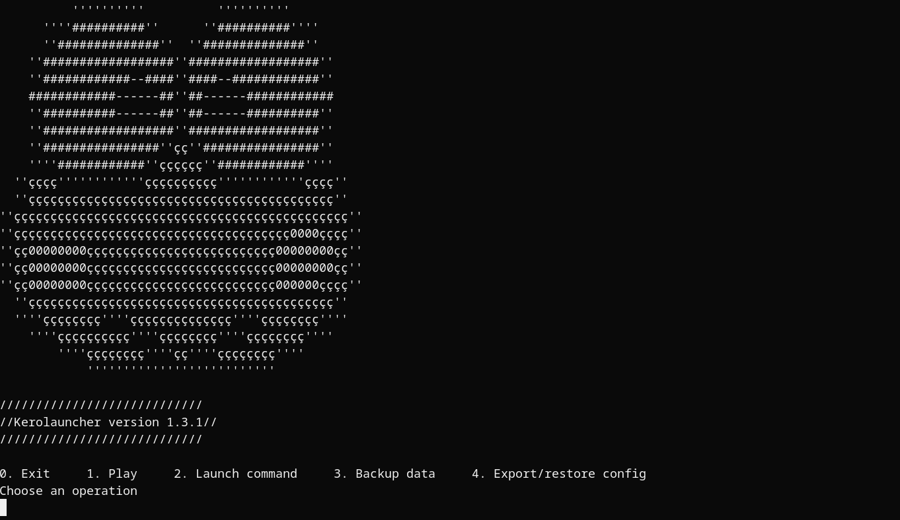

# Kerolauncher

<p align="center">

</p>

Kerolauncher is a cross-platform CLI launcher for launching games and general programs. The launcher makes it fast and convenient to launch your programs and games from 1 source while also providing support for backups, custom commands, and more.

### Current features:
* Native execution of any software
* Launching any command you want
* Launching programs through Wine and Lutris (Unix-like)
* Launching programs with appimage-run or steam-run (NixOS)
* Extensive configuration
* Automatic and manual backups
* Error checking
* Config backup and restoration
* Out-of-the-box handy support for using emulators
* Interactive menu (terminal user interface)
* High portability without clutter (doesn't write on .config, .local/share, AppData, etc)

<p align="center">

</p>

# Download and how to use
## Download
Kerolauncher works on most operative systems known to man, as long as they support Ruby. This includes Linux, Windows, MacOS, FreeBSD, other BSDs and even possibly Haiku, Solaris and others. Kerolauncher is an interpreted program so it requires the Ruby interpreter to be installed to work (Recommended >=3.0.0).

Download Kerolauncher [from here](https://github.com/spacebanana420/Kerolauncher/releases) or from the repository directly (less stable).

If you are on Linux/MacOS/BSD/etc and you want to play Windows-exclusive games, you also require Wine to play and optionally Lutris.

## Install Ruby (Windows and MacOS)
Install Ruby [from the official website](https://www.ruby-lang.org/en/) and follow the instructions

## Install Ruby (Linux, BSD, etc)
Install the Ruby package from your native package manager or compile from source

* Debian: ```apt install ruby```
* Arch: ```pacman -S ruby```

## How to use
Open config.rb in the config folder and set up your games, this setup is required.

After everything is configured, you can execute the launcher from a terminal with ```ruby kerolauncher.rb```.

# Configuration
Kerolauncher's configuration is located directly in config.rb, inside the config folder. Configuration for game names, game paths and backup paths is required.

Settings with [] mean that they support multiple entries. Each entry needs to be inside quotation marks and separated by commas, but they can be separated by lines as well, to make it easier to read.

Windows users can ignore everything related to Wine and Lutris
